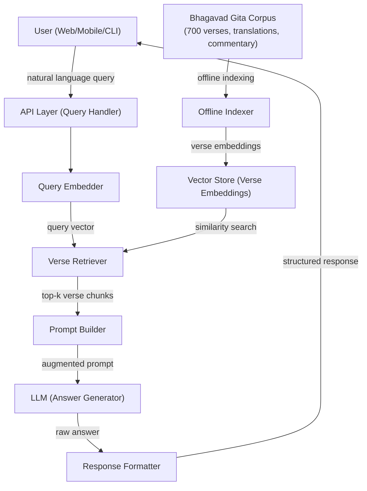
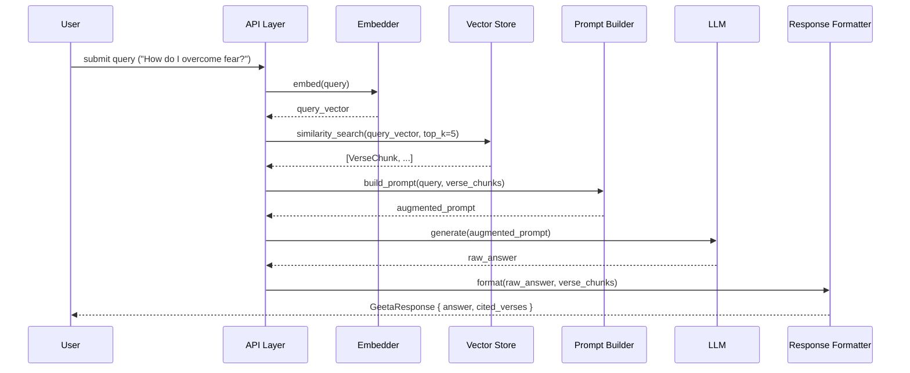
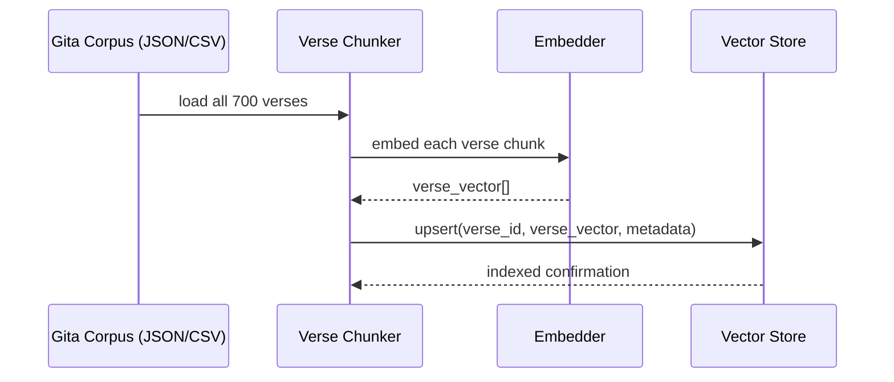

# Design Document: Geetopadesha

## Overview

Geetopadesha is an AI-powered application that answers user queries grounded in the 700 verses of the Bhagavad Gita. The system interprets natural language questions, retrieves semantically relevant verses, and synthesizes responses that faithfully reflect the teachings of the Gita — providing spiritual guidance, philosophical insight, and practical wisdom.

The application combines a vector-based semantic search over the Gita corpus with a large language model (LLM) that is constrained to answer only within the scope of the Bhagavad Gita's teachings. This ensures responses are authentic, traceable to specific verses, and grounded in the original text.

The design follows a Retrieval-Augmented Generation (RAG) architecture: user queries are embedded, matched against pre-indexed verse embeddings, and the top-k relevant verses are injected into the LLM prompt as context. The LLM then generates a response citing those verses.

---

## Architecture



---

## Sequence Diagrams

### Main Query Flow



### Offline Indexing Flow



---

## Components and Interfaces

### Component 1: API Layer (Query Handler)

**Purpose**: Entry point for all user queries; orchestrates the RAG pipeline.

**Interface**:
```pascal
INTERFACE QueryHandler
  PROCEDURE handleQuery(request: QueryRequest): QueryResponse
  PROCEDURE healthCheck(): HealthStatus
END INTERFACE
```

**Responsibilities**:
- Validate and sanitize incoming queries
- Orchestrate embedder → retriever → prompt builder → LLM → formatter pipeline
- Handle errors and timeouts gracefully
- Rate-limit requests per user/session

---

### Component 2: Embedder

**Purpose**: Converts text (queries and verses) into dense vector representations.

**Interface**:
```pascal
INTERFACE Embedder
  PROCEDURE embed(text: String): Vector
  PROCEDURE embedBatch(texts: List<String>): List<Vector>
END INTERFACE
```

**Responsibilities**:
- Use a pre-trained sentence embedding model (e.g., multilingual model supporting Sanskrit/English)
- Cache embeddings for repeated queries
- Normalize output vectors for cosine similarity

---

### Component 3: Vector Store

**Purpose**: Stores and retrieves verse embeddings via approximate nearest-neighbor search.

**Interface**:
```pascal
INTERFACE VectorStore
  PROCEDURE upsert(id: String, vector: Vector, metadata: VerseMetadata): Void
  PROCEDURE similaritySearch(queryVector: Vector, topK: Integer): List<VerseChunk>
  PROCEDURE deleteAll(): Void
END INTERFACE
```

**Responsibilities**:
- Persist verse embeddings with metadata (chapter, verse number, Sanskrit text, translation, commentary)
- Support cosine similarity search
- Return top-k results with similarity scores

---

### Component 4: Prompt Builder

**Purpose**: Constructs the LLM prompt by combining the user query with retrieved verse context.

**Interface**:
```pascal
INTERFACE PromptBuilder
  PROCEDURE buildPrompt(query: String, verses: List<VerseChunk>): Prompt
END INTERFACE
```

**Responsibilities**:
- Inject system instructions constraining the LLM to Gita teachings only
- Format verse citations clearly within the prompt
- Respect LLM context window limits (truncate/prioritize if needed)

---

### Component 5: LLM (Answer Generator)

**Purpose**: Generates a natural language answer grounded in the provided verse context.

**Interface**:
```pascal
INTERFACE AnswerGenerator
  PROCEDURE generate(prompt: Prompt): RawAnswer
END INTERFACE
```

**Responsibilities**:
- Call the configured LLM API (e.g., OpenAI, Anthropic, local model)
- Pass system prompt enforcing Gita-only scope
- Return raw text response

---

### Component 6: Response Formatter

**Purpose**: Structures the raw LLM output into a clean, user-facing response with verse citations, Sanskrit text, and English translation.

**Interface**:
```pascal
INTERFACE ResponseFormatter
  PROCEDURE format(rawAnswer: RawAnswer, verses: List<VerseChunk>): GeetaResponse
END INTERFACE
```

**Responsibilities**:
- Attach cited verse references (chapter:verse) to the response
- Include the Sanskrit text (Devanagari), transliteration, and English translation for each cited verse
- Sanitize output (remove hallucinated citations)
- Support multiple output formats (JSON, plain text, markdown)

---

## Data Models

### QueryRequest

```pascal
STRUCTURE QueryRequest
  query: String          // user's natural language question (non-empty, max 1000 chars)
  language: String       // preferred response language ("en", "hi", "sa") default "en"
  topK: Integer          // number of verses to retrieve, default 5, max 10
  sessionId: String      // optional, for conversation context
END STRUCTURE
```

**Validation Rules**:
- `query` must be non-empty and ≤ 1000 characters
- `language` must be one of: "en", "hi", "sa"
- `topK` must be between 1 and 10

---

### VerseChunk

```pascal
STRUCTURE VerseChunk
  verseId: String        // e.g., "2.47"
  chapter: Integer       // 1–18
  verse: Integer         // verse number within chapter
  sanskrit: String       // original Sanskrit text (Devanagari)
  transliteration: String
  translation: String    // English translation
  commentary: String     // optional Shankaracharya / Prabhupada commentary excerpt
  similarityScore: Float // cosine similarity to query vector (0.0–1.0)
END STRUCTURE
```

---

### GeetaResponse

```pascal
STRUCTURE GeetaResponse
  answer: String                   // AI-generated answer in plain, layman-friendly English
  citedVerses: List<CitedVerse>    // verses used as context, each with full display fields
  language: String
  queryId: String                  // unique ID for traceability
  confidence: Float                // average similarity score of cited verses
END STRUCTURE

STRUCTURE CitedVerse
  verseId: String          // e.g., "2.47"
  chapter: Integer         // 1–18
  verse: Integer           // verse number within chapter
  sanskrit: String         // original Sanskrit text (Devanagari script)
  transliteration: String  // Roman transliteration of the Sanskrit
  translation: String      // plain English translation of the verse
  similarityScore: Float   // relevance score (0.0–1.0)
END STRUCTURE
```

---

### Prompt

```pascal
STRUCTURE Prompt
  systemInstruction: String   // constrains LLM to Gita scope
  verseContext: String        // formatted verse excerpts
  userQuery: String
  fullText: String            // assembled prompt sent to LLM
END STRUCTURE
```

---

## Algorithmic Pseudocode

### Main Query Processing Algorithm

```pascal
ALGORITHM handleQuery(request)
INPUT: request of type QueryRequest
OUTPUT: response of type GeetaResponse

BEGIN
  ASSERT validateRequest(request) = true

  // Step 1: Embed the user query
  queryVector ← embedder.embed(request.query)
  ASSERT queryVector IS NOT NULL

  // Step 2: Retrieve semantically relevant verses
  verseChunks ← vectorStore.similaritySearch(queryVector, request.topK)
  ASSERT LENGTH(verseChunks) > 0

  // Step 3: Build augmented prompt
  prompt ← promptBuilder.buildPrompt(request.query, verseChunks)
  ASSERT LENGTH(prompt.fullText) <= MAX_CONTEXT_TOKENS

  // Step 4: Generate answer via LLM
  rawAnswer ← llm.generate(prompt)
  ASSERT rawAnswer IS NOT NULL AND rawAnswer IS NOT EMPTY

  // Step 5: Format and return response
  response ← formatter.format(rawAnswer, verseChunks)
  ASSERT response.citedVerses IS NOT EMPTY

  RETURN response
END
```

**Preconditions**:
- `request.query` is non-empty and within length limits
- Vector store is initialized and populated with all 700 verse embeddings
- LLM service is reachable

**Postconditions**:
- `response.answer` is non-empty
- `response.citedVerses` contains at least one verse
- All cited verses are traceable to valid Gita chapter:verse references

**Loop Invariants**: N/A (no loops in main flow)

---

### Offline Verse Indexing Algorithm

```pascal
ALGORITHM indexGitaCorpus(corpusPath)
INPUT: corpusPath of type String (path to verse dataset)
OUTPUT: indexedCount of type Integer

BEGIN
  verses ← loadCorpus(corpusPath)
  ASSERT LENGTH(verses) = 700

  indexedCount ← 0

  FOR each verse IN verses DO
    ASSERT verse.verseId IS NOT NULL
    ASSERT verse.translation IS NOT NULL

    // Combine fields for richer embedding
    textToEmbed ← CONCAT(verse.translation, " ", verse.commentary)
    vector ← embedder.embed(textToEmbed)

    metadata ← VerseMetadata {
      chapter: verse.chapter,
      verse: verse.verse,
      sanskrit: verse.sanskrit,
      transliteration: verse.transliteration,
      translation: verse.translation,
      commentary: verse.commentary
    }

    vectorStore.upsert(verse.verseId, vector, metadata)
    indexedCount ← indexedCount + 1
  END FOR

  ASSERT indexedCount = 700
  RETURN indexedCount
END
```

**Preconditions**:
- Corpus file exists and is parseable
- Corpus contains exactly 700 verse records
- Each verse has at minimum: verseId, chapter, verse number, translation

**Postconditions**:
- All 700 verses are indexed in the vector store
- Each verse is retrievable by similarity search
- `indexedCount = 700`

**Loop Invariants**:
- After processing k verses: `indexedCount = k`
- All previously indexed verses remain in the vector store

---

### Prompt Building Algorithm

```pascal
ALGORITHM buildPrompt(query, verseChunks)
INPUT: query of type String, verseChunks of type List<VerseChunk>
OUTPUT: prompt of type Prompt

BEGIN
  systemInstruction ← "You are Geetopadesha, a friendly spiritual guide who answers questions
    exclusively based on the teachings of the Bhagavad Gita. Use only the provided
    verse context to answer. Always cite the chapter and verse number (e.g., BG 2.47).
    Do not introduce teachings from outside the Bhagavad Gita.
    When responding in English, use simple, everyday language that anyone can understand —
    avoid Sanskrit jargon, philosophical abstractions, or complex vocabulary. Explain the
    Gita's wisdom as if talking to a friend, making it directly relevant and practical to
    the user's question."

  verseContext ← ""
  tokenCount ← 0

  FOR each chunk IN verseChunks DO
    chunkText ← FORMAT("BG {chunk.verseId}: {chunk.translation}\n{chunk.commentary}\n\n")
    chunkTokens ← estimateTokens(chunkText)

    IF tokenCount + chunkTokens <= MAX_VERSE_CONTEXT_TOKENS THEN
      verseContext ← CONCAT(verseContext, chunkText)
      tokenCount ← tokenCount + chunkTokens
    END IF
  END FOR

  fullText ← FORMAT(
    "SYSTEM: {systemInstruction}\n\n
     CONTEXT (Bhagavad Gita Verses):\n{verseContext}\n
     USER QUESTION: {query}\n
     ANSWER:"
  )

  RETURN Prompt {
    systemInstruction: systemInstruction,
    verseContext: verseContext,
    userQuery: query,
    fullText: fullText
  }
END
```

**Preconditions**:
- `query` is non-empty
- `verseChunks` is non-empty list
- `MAX_VERSE_CONTEXT_TOKENS` is defined

**Postconditions**:
- `prompt.fullText` does not exceed `MAX_CONTEXT_TOKENS`
- System instruction is always present
- At least one verse chunk is included in context

**Loop Invariants**:
- `tokenCount` never exceeds `MAX_VERSE_CONTEXT_TOKENS`
- All included chunks are valid VerseChunk objects

---

### Input Validation Algorithm

```pascal
ALGORITHM validateRequest(request)
INPUT: request of type QueryRequest
OUTPUT: isValid of type Boolean

BEGIN
  IF request IS NULL THEN
    RETURN false
  END IF

  IF request.query IS NULL OR TRIM(request.query) = "" THEN
    RETURN false
  END IF

  IF LENGTH(request.query) > 1000 THEN
    RETURN false
  END IF

  IF request.language NOT IN ["en", "hi", "sa"] THEN
    RETURN false
  END IF

  IF request.topK < 1 OR request.topK > 10 THEN
    RETURN false
  END IF

  RETURN true
END
```

**Preconditions**: `request` parameter is provided (may be null)

**Postconditions**:
- Returns `true` if and only if all fields pass validation
- No mutations to `request`

---

## Key Functions with Formal Specifications

### embed(text)

```pascal
PROCEDURE embed(text: String): Vector
```

**Preconditions**:
- `text` is non-null and non-empty

**Postconditions**:
- Returns a fixed-dimension float vector (e.g., 768 or 1536 dimensions)
- Vector is L2-normalized (magnitude ≈ 1.0) for cosine similarity
- Same input always produces the same output (deterministic)

---

### similaritySearch(queryVector, topK)

```pascal
PROCEDURE similaritySearch(queryVector: Vector, topK: Integer): List<VerseChunk>
```

**Preconditions**:
- `queryVector` is a valid normalized vector
- `topK` is between 1 and 10
- Vector store contains at least `topK` indexed verses

**Postconditions**:
- Returns exactly `topK` results (or fewer if store has fewer entries)
- Results are sorted by `similarityScore` descending
- Each result's `similarityScore` is in range [0.0, 1.0]

---

### generate(prompt)

```pascal
PROCEDURE generate(prompt: Prompt): RawAnswer
```

**Preconditions**:
- `prompt.fullText` is non-empty and within LLM context window
- LLM API is reachable and authenticated

**Postconditions**:
- Returns non-empty string
- Response is grounded in provided verse context (enforced by system instruction)
- Does not contain PII or harmful content (enforced by LLM safety filters)

---

## Example Usage

```pascal
// Example 1: Basic spiritual query
SEQUENCE
  request ← QueryRequest {
    query: "How do I overcome fear and anxiety?",
    language: "en",
    topK: 5,
    sessionId: "session-001"
  }

  response ← queryHandler.handleQuery(request)

  DISPLAY response.answer
  // "Feeling scared or anxious? The Gita says (BG 2.14) that tough feelings don't last forever —
  //  they come and go like summer and winter. The key is to not let them shake you. Just stay
  //  steady and keep doing what you need to do."

  FOR each verse IN response.citedVerses DO
    DISPLAY FORMAT("─────────────────────────────")
    DISPLAY FORMAT("BG {verse.verseId}")
    DISPLAY FORMAT("Sanskrit: {verse.sanskrit}")
    DISPLAY FORMAT("Transliteration: {verse.transliteration}")
    DISPLAY FORMAT("Translation: {verse.translation}")
  END FOR
END SEQUENCE

// Example 2: Duty and action query
SEQUENCE
  request ← QueryRequest {
    query: "What does the Gita say about performing one's duty?",
    language: "en",
    topK: 5
  }

  response ← queryHandler.handleQuery(request)
  // Expects BG 2.47 ("You have a right to perform your duties...") in cited verses
END SEQUENCE

// Example 3: Out-of-scope query (graceful handling)
SEQUENCE
  request ← QueryRequest {
    query: "What is the capital of France?",
    language: "en",
    topK: 5
  }

  response ← queryHandler.handleQuery(request)
  // LLM responds: "This question falls outside the teachings of the Bhagavad Gita.
  //  I can only answer questions grounded in the Gita's wisdom."
END SEQUENCE
```

---

## Correctness Properties

*A property is a characteristic or behavior that should hold true across all valid executions of a system — essentially, a formal statement about what the system should do. Properties serve as the bridge between human-readable specifications and machine-verifiable correctness guarantees.*

### Property 1: Whitespace queries are rejected

*For any* string composed entirely of whitespace characters (including the empty string), submitting it as a query should be rejected with an HTTP 400 response and the QueryRequest should remain unmodified.

**Validates: Requirements 1.1, 1.5**

---

### Property 2: Overlength queries are rejected

*For any* query string whose length exceeds 1000 characters, the Query_Handler should reject it with an HTTP 400 response.

**Validates: Requirements 1.2**

---

### Property 3: Invalid language codes are rejected

*For any* language string that is not one of "en", "hi", or "sa", the Query_Handler should reject the request with an HTTP 400 response.

**Validates: Requirements 1.3**

---

### Property 4: Out-of-range topK values are rejected

*For any* integer topK that is less than 1 or greater than 10, the Query_Handler should reject the request with an HTTP 400 response.

**Validates: Requirements 1.4**

---

### Property 5: Embedding fixed dimension

*For any* non-empty text string, the Embedder should return a vector of the same fixed dimension every time, regardless of the content or length of the input.

**Validates: Requirements 2.1**

---

### Property 6: Embedding L2 normalization

*For any* non-empty text string, the magnitude of the vector returned by the Embedder should be approximately 1.0 (within a small floating-point tolerance).

**Validates: Requirements 2.2**

---

### Property 7: Embedding determinism

*For any* text string, embedding it twice should produce identical vectors (same values at every dimension).

**Validates: Requirements 2.3**

---

### Property 8: Indexing completeness

*For any* valid 700-verse Corpus, after the Indexer completes, the Vector_Store should contain exactly 700 records, one for each verse.

**Validates: Requirements 3.1**

---

### Property 9: Indexed verse metadata completeness

*For any* verse in the Corpus, after indexing, retrieving that verse's metadata from the Vector_Store should return all required fields: Sanskrit text, transliteration, English translation, commentary, chapter number, and verse number.

**Validates: Requirements 3.2**

---

### Property 10: Similarity search result ordering and bounds

*For any* valid query vector and any topK in [1, 10], the Vector_Store should return at most topK results, sorted by Similarity_Score in descending order, with every score in the range [0.0, 1.0].

**Validates: Requirements 4.1, 4.2**

---

### Property 11: Prompt structure completeness

*For any* non-empty query string and any non-empty list of VerseChunks, the Prompt_Builder should produce a Prompt whose fullText contains the system instruction, at least one verse chunk, and the user query.

**Validates: Requirements 5.1, 5.2, 5.5**

---

### Property 12: Token budget invariant

*For any* query and any list of VerseChunks, the fullText of the assembled Prompt should never exceed MAX_CONTEXT_TOKENS.

**Validates: Requirements 5.3**

---

### Property 13: Verse truncation respects score ordering

*For any* list of VerseChunks whose combined token count exceeds MAX_VERSE_CONTEXT_TOKENS, the Prompt_Builder should include verses in descending Similarity_Score order and exclude only the lowest-ranked verses to stay within the budget.

**Validates: Requirements 5.4**

---

### Property 14: Response formatter output completeness

*For any* raw answer string and any non-empty list of VerseChunks, the Response_Formatter should produce a GeetaResponse with a non-empty answer and at least one CitedVerse containing Sanskrit text, transliteration, and English translation.

**Validates: Requirements 7.1, 7.2**

---

### Property 15: Unique query IDs

*For any* two independently processed QueryRequests, the queryId values in their respective GeetaResponses should be distinct.

**Validates: Requirements 7.3, 10.2**

---

### Property 16: Confidence score accuracy

*For any* GeetaResponse, the confidence field should equal the arithmetic mean of the Similarity_Score values of all CitedVerses in that response.

**Validates: Requirements 7.4**

---

### Property 17: Invalid verse references are filtered

*For any* raw answer that contains verse references with chapter numbers outside 1–18 or verse numbers that do not exist in the Corpus, the Response_Formatter should exclude those references from the citedVerses list.

**Validates: Requirements 7.5**

---

### Property 18: Query sanitization removes control characters

*For any* input string containing control characters or special tokens, the sanitized query produced by the Query_Handler should contain none of those characters.

**Validates: Requirements 9.1**

---

## Error Handling

### Error Scenario 1: LLM Service Unavailable

**Condition**: LLM API returns 5xx or times out
**Response**: Return HTTP 503 with message "Answer generation temporarily unavailable"
**Recovery**: Retry up to 3 times with exponential backoff; fall back to returning raw verse excerpts without LLM synthesis

### Error Scenario 2: No Relevant Verses Found

**Condition**: All retrieved verses have similarity score below threshold (e.g., < 0.3)
**Response**: Return a response indicating the query may be outside Gita's scope, with the closest verse found
**Recovery**: Lower threshold and retry once; if still below, return graceful "out of scope" message

### Error Scenario 3: Embedding Service Failure

**Condition**: Embedder fails to produce a vector
**Response**: Return HTTP 500 with error detail
**Recovery**: Retry once; if fails again, return error to user

### Error Scenario 4: Invalid Query

**Condition**: `validateRequest` returns false
**Response**: Return HTTP 400 with specific validation error message
**Recovery**: No retry; user must correct input

### Error Scenario 5: Context Window Exceeded

**Condition**: Assembled prompt exceeds LLM token limit
**Response**: Truncate verse context to fit within budget (handled in `buildPrompt`)
**Recovery**: Reduce `topK` by 1 and rebuild prompt until it fits

---

## Testing Strategy

### Unit Testing Approach

Test each component in isolation with mocked dependencies:
- `validateRequest`: test all boundary conditions (empty query, max length, invalid language, topK bounds)
- `buildPrompt`: verify token budget is never exceeded, system instruction always present
- `format`: verify cited verses are attached, output structure is correct
- `indexGitaCorpus`: verify exactly 700 verses are indexed, each with valid metadata

### Property-Based Testing Approach

**Property Test Library**: fast-check (JavaScript) or hypothesis (Python)

Key properties to test:
- For any valid query string, `embed(query)` returns a vector of fixed dimension
- For any `topK` in [1,10], `similaritySearch` returns ≤ `topK` results sorted by score descending
- For any set of verse chunks, `buildPrompt` never produces a prompt exceeding `MAX_CONTEXT_TOKENS`
- For any 700-verse corpus, `indexGitaCorpus` always results in `indexedCount = 700`

### Integration Testing Approach

- End-to-end query flow: submit a known query ("nishkama karma"), verify BG 2.47 or BG 3.19 appears in cited verses
- Indexing pipeline: run full indexing, then query each chapter's key verse and verify retrieval
- Out-of-scope query: verify LLM response contains scope-refusal language

---

## Performance Considerations

- Verse embeddings are pre-computed offline; query-time only requires embedding the user query (single inference call)
- Vector similarity search over 700 verses is extremely fast (< 5ms) even with exact search; approximate search not required at this scale
- LLM response latency dominates (typically 1–5 seconds); consider streaming responses to improve perceived performance
- Cache embeddings for repeated identical queries using an LRU cache keyed on query text

---

## Security Considerations

- Sanitize user queries to prevent prompt injection attacks (strip control characters, limit special tokens)
- The system prompt explicitly constrains the LLM to Gita scope, reducing jailbreak surface
- API keys for LLM and embedding services must be stored in environment variables, never in code
- Rate limiting per session/IP to prevent abuse
- No user PII is stored; session IDs are ephemeral

---

## Dependencies

- Embedding model: sentence-transformers (e.g., `paraphrase-multilingual-mpnet-base-v2`) or OpenAI `text-embedding-ada-002`
- Vector store: Chroma, Pinecone, Weaviate, or pgvector (depending on deployment target)
- LLM: OpenAI GPT-4, Anthropic Claude, or a locally hosted model (Ollama)
- Bhagavad Gita corpus: structured dataset with Sanskrit, transliteration, English translation, and commentary for all 700 verses (e.g., from sacred-texts.com or a curated JSON dataset)
- API framework: FastAPI (Python) or Express (Node.js)
